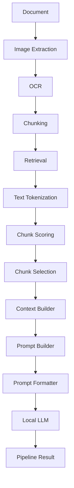
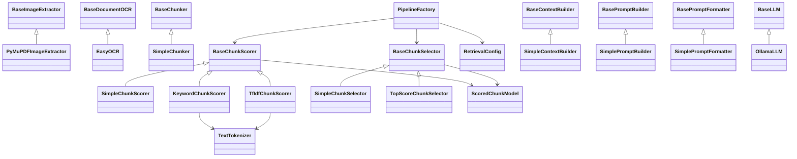

Project Title:
# DocumentAI

Tagline:
AI-powered modular document intelligence pipeline.

Project Overview: DocumentAI is a modular document intelligence pipeline designed to transform raw documents into high-quality AI-ready knowledge. The project combines document preprocessing, OCR, chunking, configurable document retrieval, context engineering, prompt engineering, and local Large Language Model (LLM) integration into a clean, extensible architecture.
Instead of treating OCR, retrieval, prompting, and LLM interaction as isolated components, DocumentAI organizes them into a structured processing pipeline where every stage has a single responsibility and can be independently tested, replaced, or extended. The primary objective of this project is to provide a production-oriented foundation for AI-powered document analysis while demonstrating modern software architecture, clean code practices, automated testing, and modular Retrieval strategies.

## Features

### 📄 Document Processing

- Image extraction from document pages
- OCR-based text extraction
- Modular document chunking pipeline

### 🔎 Document Retrieval

- Configurable chunk scoring strategies
- Keyword-based Retrieval
- TF-IDF Retrieval
- Scored chunk representation
- Configurable chunk selection
- Top-score chunk selection
- Minimum score threshold
- Top-K chunk selection

### 🧠 Context Engineering

- Context Builder abstraction
- Context generation from document chunks
- Immutable context model

### ✍️ Prompt Engineering

- Prompt Builder abstraction
- Prompt Model
- Prompt Formatter for LLM providers

### 🤖 LLM Integration

- Local LLM integration using Ollama
- Provider-independent LLM interface
- Structured LLM response model

### 🏗️ Software Architecture

- Modular pipeline architecture
- Dependency injection across components
- Replaceable implementations through abstract interfaces
- Strong separation of responsibilities

### ✅ Quality Assurance

- Extensive unit test coverage
- Version-driven development
- Roadmap-driven architecture evolution

## Architecture

DocumentAI is designed as a modular processing pipeline where every stage has a single responsibility and communicates through well-defined abstractions.

The system follows a layered architecture that makes each component independently testable, replaceable, and easy to extend without affecting the rest of the pipeline.

### Processing Flow

### Software Architecture

The processing pipeline depends only on abstract interfaces rather than concrete implementations. This design enables components to be replaced, extended, or tested independently while keeping the overall architecture stable.

## Current Status

The project currently has a configurable document Retrieval layer
supporting:

- Keyword-based scoring
- TF-IDF scoring
- Top-score chunk selection
- Minimum score filtering
- Maximum chunk selection (Top-K)
- Retrieval configuration through `RetrievalConfig`
- Retrieval component construction through `PipelineFactory`

The current development focus is:

1. Multi-document Retrieval and reasoning
2. Persian-aware Retrieval optimization
3. Future semantic and hybrid Retrieval

## Documentation

- [Architecture](docs/01_Architecture.md)
- [Roadmap](docs/02_Roadmap.md)
- [Prompt Strategy](docs/03_PromptStrategy.md)
- [Developer Guide](docs/04_DeveloperGuide.md)

